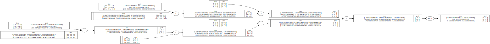

# tensorgrad


A derivative of micrograd, altered to process multidimensional arrays of scalar values.


### Example usage

Below is a slightly contrived example showing a number of possible supported operations:

```python
from micrograd.engine import Value

a = Value([[-4.0,-8.0],[-2.0,-4.0]])
b = Value([[2.0,6.0],[4.0,8.0]])
c = a + b
d = a * b + b**3 #applies the pow 3 to all values in the tensor
c += c + 1 #auto-converts the scalar 1 into a gradient-tracked tensor value of [[1,1],[1,1]] to match the shape of the tensor in c
c += 1 + c + (-a)
d += d * 2 + (b + a).relu()
d += 3 * d + (b - a).relu()
e = c - d
f = e**2
g = f / 2.0
g += 10.0/ f
print(g.data) # prints the outcome of the forward pass for all four values in the tensor
g.backward()
print(a.grad) # prints the numerical value of dg/d for all four values in the tensor
print(b.grad) # prints the numerical value of dg/db for all four values in the tensor
```


### Tracing / visualization

For convenience, the notebook `trace_graph.ipynb` produces graphviz visualizations. E.g. this one below is of a simple 2D neuron, arrived at by calling `draw_dot` on the code below, and it shows both the data (left number in each node) and the gradient (right number in each node).

```python
from tensorgrad import nn
n = nn.Neuron(2, [3,3])
x = [Value([[1.0,2.0,3.0],[4.0,5.0,6.0],[7.0,8.0,9.0]]), Value([[-2.0,-4.0,-5.0],[-6.0,-7.0,-8.0],[-9.0,-10.0,-11.0]])]
y = n(x)
y.backward()

dot = draw_dot(y)
```




### License

MIT
